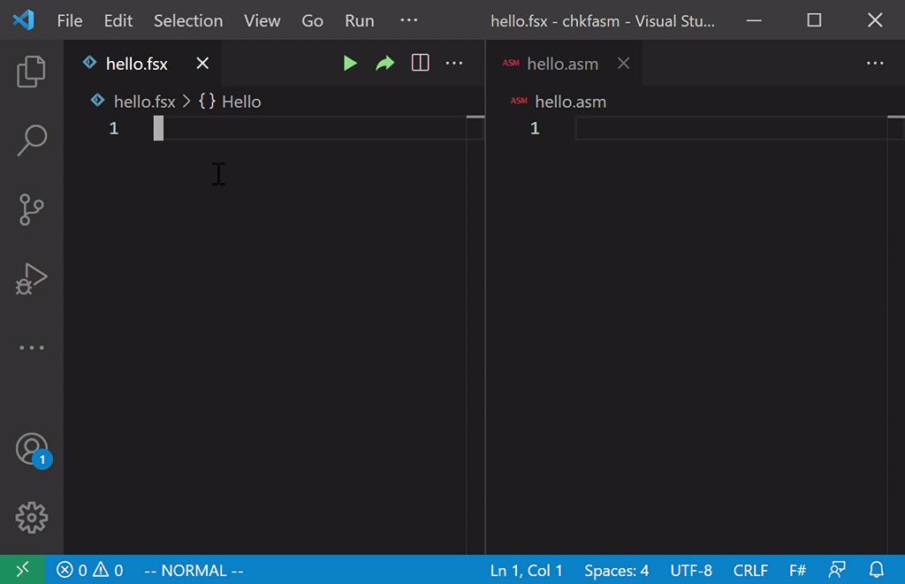

<br />

<p align="center">
    
</p>

<p align="center">
     
     
    
</p>

<br />

Fasmi is a F# to Jitted ASM / IL disassembler as a dotnet tool. Maintained by folks at [D-EDGE](https://www.d-edge.com/).



# Getting Started

Install fasmi as a global dotnet tool

``` bash
dotnet tool install fasmi -g
``` 

or as a dotnet local tool

``` bash
dotnet new tool-manifest
dotnet tool install fasmi
```` 

# Quickstart

Create a demo.fsx F# interactive script:

``` fsharp
let inc x = x+1
```

run fasmi:
``` bash
dotnet fasmi ./demo.fsx
```

and open at the generated demo.asm file:

``` asm
Demo.inc(Int32)
L0000: lea eax, [rcx+1]
L0003: ret
```

## Watch mode

run fasmi in watch mode:
``` bash
dotnet fasmi ./demo.fsx -w
```

Open the demo.fsx and demo.asm files side by side in your favorite editor, make changes to demo.fsx and save. The demo.asm file is updated on the fly.


# Usage

```
USAGE: dotnet fasmi [--help] [--console] [--output <string>] [--watch] [--platform <x86|x64>] [--language <asm|il>] <string>

SOURCE:

    <string>              the source fsx or dotnet assembly file

OPTIONS:

    --console, -c         output to console
    --output, -o <string> specifiy the output file
    --watch, -w           run in watch mode
    --platform, -p <x86|x64>
                          specify the platform for disassembly
    --language, -l <asm|il>
                          specify the output language (asm/il)
    --help                display this list of options.
```

## Input

The input can be a fsx F# script file or any dotnet .dll assemlby file. F# scripts are compiled for net 5.0.

Using a dotnet assembly as an input, you can use fasmi on any dotnet language.

## Console

With the `-c` flag, the result is output to console rather than in a file.

## Output

Use the `-o` flag to specifie the target file path and name.

## Watch

The `-w` flag runs fasmi in watch mode. The file is recompiled and disassembled automatically when saved.

## Platform

Use the `-p` flag to force x64 or x86 platform for disassembly.

## Language

Specify the target language with the `-l` flag:

* asm : disassemble the jit output as a x86/x86 .asm file
* il : disassemble the output as a MSIL .il file

# Acknowledgment

This tool is based on [Andrey Shchekin](https://github.com/ashmind) code for [https://sharplab.io/](https://sharplab.io/).

# Contributing

Help and feedback is always welcome and pull requests get accepted.

* First open an issue to discuss your changes
* After your change has been formally approved please submit your PR against the develop branch
* Please follow the code convention by examining existing code
* Add/modify the README.md as required
* Add/modify unit tests as required
* Please document your changes in the upcoming release notes in RELEASE_NOTES.md
* PRs can only be approved and merged when all checks succeed (builds on Windows, MacOs and Linux)

# License

[MIT](./LICENSE)


